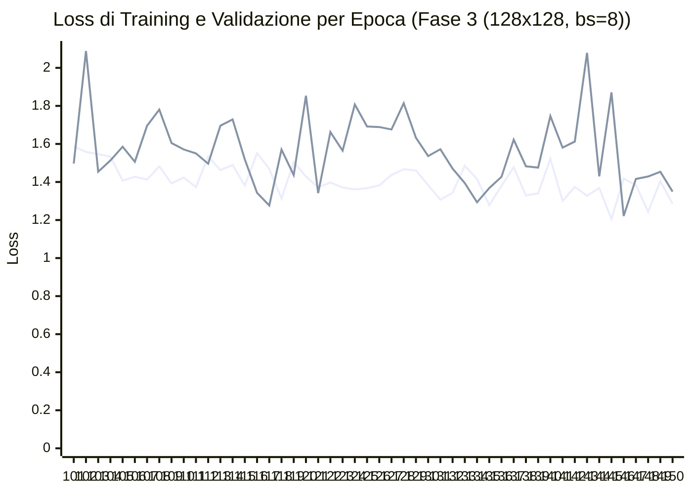
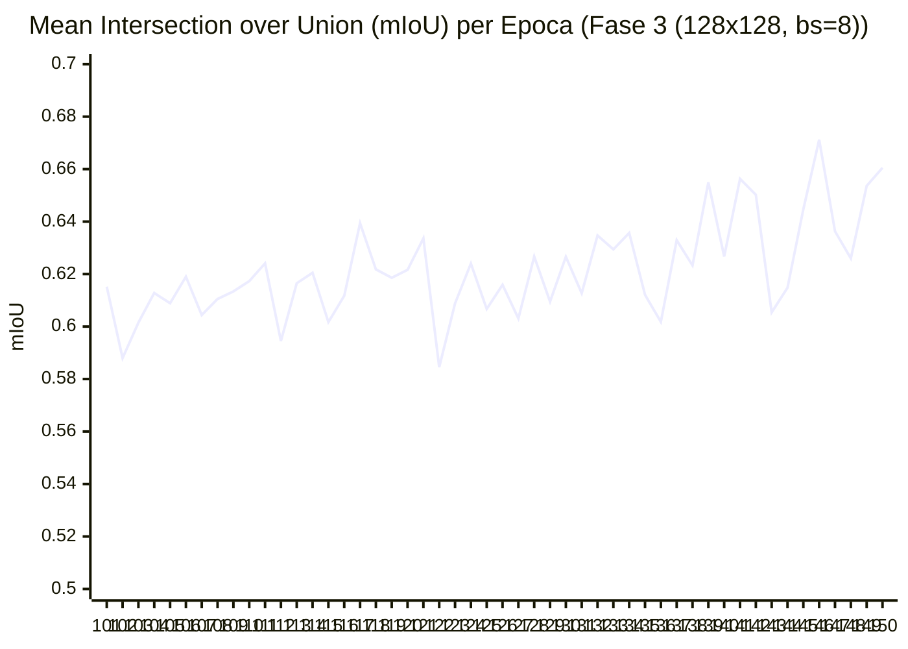

```mermaid
xychart-beta title "Loss di Training e Validazione per Epoca (Fase 3 (128x128, bs=8))" x-axis [101,102,103,104,105,106,107,108,109,110,111,112,113,114,115,116,117,118,119,120,121,122,123,124,125,126,127,128,129,130,131,132,133,134,135,136,137,138,139,140,141,142,143,144,145,146,147,148,149,150] y-axis "Loss" 0.0 --> 2.1 line [1.586, 1.558, 1.5464, 1.5336, 1.4072, 1.4278, 1.413, 1.4821, 1.3923, 1.4233, 1.373, 1.5344, 1.4623, 1.4891, 1.3814, 1.5513, 1.4693, 1.3132, 1.5047, 1.4289, 1.3718, 1.3972, 1.3708, 1.3614, 1.3675, 1.3823, 1.4368, 1.4671, 1.4605, 1.3834, 1.3067, 1.3436, 1.4854, 1.4165, 1.2781, 1.3793, 1.4771, 1.3291, 1.3401, 1.5225, 1.3005, 1.3738, 1.3279, 1.3683, 1.2059, 1.4182, 1.3834, 1.2431, 1.4043, 1.2854] line [1.4972, 2.0884, 1.4538, 1.5133, 1.5854, 1.5065, 1.6957, 1.7804, 1.6048, 1.5711, 1.5502, 1.4961, 1.6959, 1.7289, 1.5184, 1.3428, 1.2764, 1.5703, 1.4364, 1.8537, 1.3416, 1.6623, 1.5645, 1.8076, 1.6919, 1.6889, 1.6761, 1.8141, 1.6324, 1.5362, 1.5722, 1.4703, 1.3941, 1.2933, 1.368, 1.427, 1.6228, 1.4825, 1.4757, 1.7464, 1.5806, 1.6125, 2.0789, 1.4294, 1.8712, 1.2212, 1.4161, 1.4288, 1.4536, 1.3494]
```

```mermaid
xychart-beta title "Mean Intersection over Union (mIoU) per Epoca (Fase 3 (128x128, bs=8))" x-axis [101,102,103,104,105,106,107,108,109,110,111,112,113,114,115,116,117,118,119,120,121,122,123,124,125,126,127,128,129,130,131,132,133,134,135,136,137,138,139,140,141,142,143,144,145,146,147,148,149,150] y-axis "mIoU" 0.5 --> 0.7 line [0.6152, 0.588, 0.6015, 0.6128, 0.6089, 0.619, 0.6044, 0.6105, 0.6134, 0.6173, 0.6241, 0.5945, 0.6165, 0.6205, 0.6017, 0.6117, 0.6394, 0.6218, 0.6186, 0.6216, 0.6336, 0.5845, 0.6088, 0.624, 0.6067, 0.6159, 0.6031, 0.6267, 0.6095, 0.6266, 0.6127, 0.6347, 0.6294, 0.6357, 0.6121, 0.6018, 0.6329, 0.6233, 0.655, 0.6267, 0.6563, 0.6502, 0.6054, 0.6148, 0.6447, 0.6712, 0.6363, 0.626, 0.6536, 0.6605]
```
